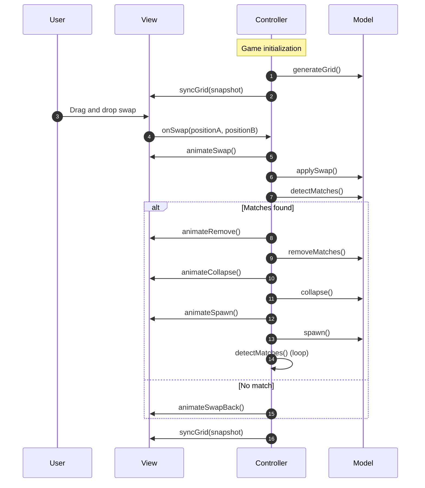

# Candy Crush

_This project was developed as part of a university practical assignment._

This document describes the setup, architecture, and execution of the Candy Crush game implemented in TypeScript Vite.

The project follows a clean MVC-inspired architecture and includes a deterministic game engine, animated rendering, and full match resolution logic.

## Compatibility

| OS                 | Status |
| ------------------ | ------ |
| macOS              | ✅     |
| Linux              | ✅     |
| Windows (via WSL2) | ✅     |
| Native Windows     | ✅     |

## Prerequisites

- Bun (https://bun.sh)
- Node.js (only if not using Bun for execution)

## Installation

```bash
bun install
```

## Usage

```bash
bun run build
# Default preview in local browser.
bun run preview
# Preview in windowed mode using NW.js (nw).
```

# Architecture overview

| Layer      | Responsibility                  |
| ---------- | ------------------------------- |
| Model      | Game logic and state management |
| View       | Rendering and animations        |
| Controller | Game flow orchestration         |

The following sequence diagram illustrates the interactions between the View, Controller, and Model during a game session.


